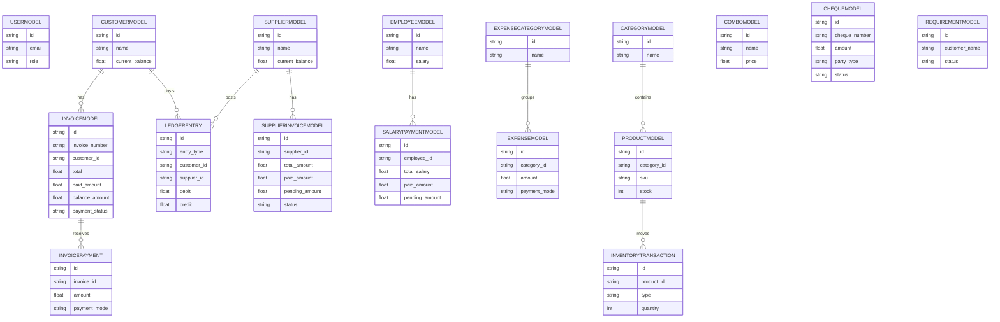
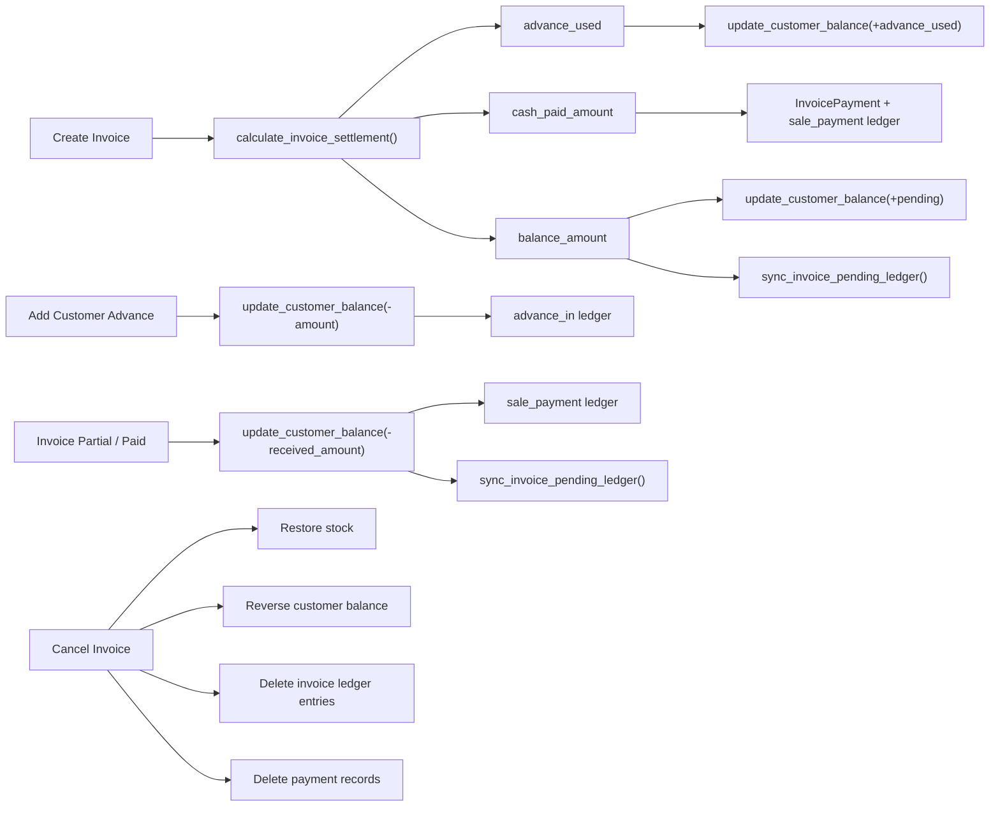
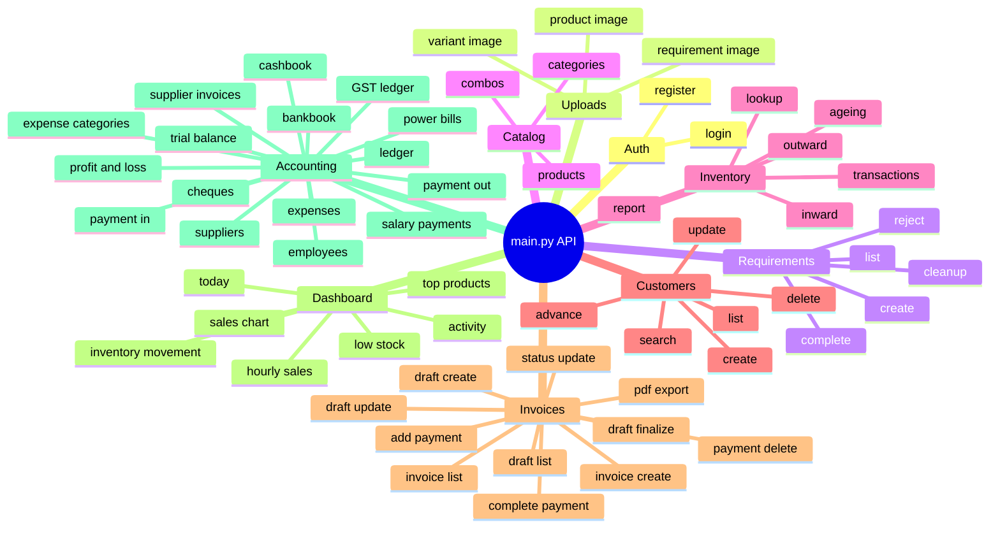

# Graphify View

This is a graph-style map of the current backend in [main.py](/D:/lights-main/b/main.py).

## System Map

```mermaid
flowchart TD
    A["FastAPI App"] --> B["Startup"]
    B --> B1["Create accounting tables"]
    B --> B2["Ensure Power Bill expense category"]
    B --> B3["Initialize Redis rate limiter"]

    A --> C["Auth"]
    C --> C1["POST /auth/register"]
    C --> C2["POST /auth/login"]

    A --> D["Master Data"]
    D --> D1["Categories"]
    D --> D2["Products"]
    D --> D3["Combos"]

    A --> E["Inventory"]
    E --> E1["Lookup by SKU"]
    E --> E2["Material Inward"]
    E --> E3["Material Outward"]
    E --> E4["Transactions"]
    E --> E5["Inventory Report PDF"]
    E --> E6["Ageing Report"]

    A --> F["Requirements"]
    F --> F1["Create"]
    F --> F2["List"]
    F --> F3["Complete / Reject"]
    F --> F4["Cleanup"]

    A --> G["Customers + Invoices"]
    G --> G1["Customers CRUD"]
    G --> G2["Customer Advance"]
    G --> G3["Draft Invoices"]
    G --> G4["Finalize Draft"]
    G --> G5["Final Invoices"]
    G --> G6["Invoice Payments"]
    G --> G7["Invoice Cancel / Status"]
    G --> G8["Invoice PDF Export"]

    A --> H["Accounting"]
    H --> H1["Expense Categories"]
    H --> H2["Expenses"]
    H --> H3["Employees"]
    H --> H4["Salary Payments"]
    H --> H5["Power Bills"]
    H --> H6["Suppliers"]
    H --> H7["Supplier Invoices"]
    H --> H8["Payment In / Out"]
    H --> H9["Ledger / Cashbook / Bankbook"]
    H --> H10["Trial Balance / GST / P&L"]
    H --> H11["Cheques"]
    H --> H12["Dashboard APIs"]
```

## Data Model Graph

## Core Balance Flow

## API Groups By Area

## Route Cluster Reference

- Auth starts around [main.py](/D:/lights-main/b/main.py#L1082)
- Draft invoice flow starts around [main.py](/D:/lights-main/b/main.py#L2278)
- Requirements starts around [main.py](/D:/lights-main/b/main.py#L3196)
- Products and inventory start around [main.py](/D:/lights-main/b/main.py#L3345)
- Customer and invoice final flow starts around [main.py](/D:/lights-main/b/main.py#L4698)
- Dashboard APIs start around [main.py](/D:/lights-main/b/main.py#L6364)
- Accounting APIs start around [main.py](/D:/lights-main/b/main.py#L6801)

## Quick Notes

- Customer balance logic is centralized around `update_customer_balance()`, `calculate_invoice_settlement()`, and `sync_invoice_pending_ledger()`.
- This file contains two `/customers` GET routes, one earlier and one later, which is worth cleaning later because route order can make behavior confusing.
- `main.py` is acting as one large monolith right now: models, schemas, helpers, business rules, and routes all live together.
